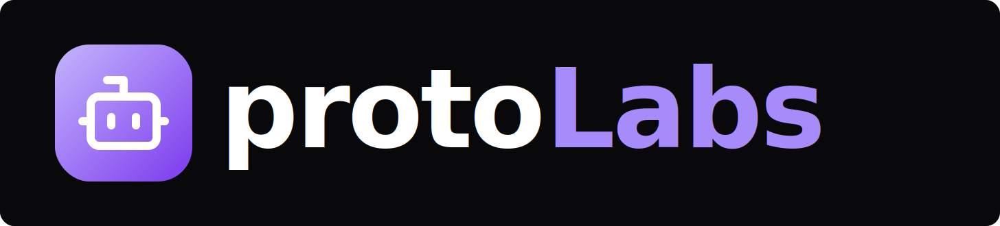

# homeMaker — Spec

> Auto-generated by Automaker ProtoLab. Fill in the placeholder sections marked with `TODO`.

## Description

    

## Tech Stack

- TypeScript 5.9.3
- react 19.2.3
- vite 7.3.0
- Tailwind CSS 4.1.18
- Express
- sqlite
- npm
- turbo
- Vitest
- Playwright

## Architecture

**Type**: Monorepo (turbo)

**Packages:**
- `apps/server` — @protolabsai/server (app)
- `apps/ui` — @protolabsai/app (app)
- `libs/dependency-resolver` — @protolabsai/dependency-resolver (package)
- `libs/error-tracking` — @protolabsai/error-tracking (package)
- `libs/flows` — @protolabsai/flows (package)
- `libs/git-utils` — @protolabsai/git-utils (package)
- `libs/model-resolver` — @protolabsai/model-resolver (package)
- `libs/observability` — @protolabsai/observability (package)
- `libs/pen-parser` — @protolabsai/pen-parser (package)
- `libs/platform` — @protolabsai/platform (package)
- `libs/prompts` — @protolabsai/prompts (package)
- `libs/spec-parser` — @protolabsai/spec-parser (package)
- `libs/templates` — @protolabsai/templates (package)
- `libs/tools` — @protolabsai/tools (package)
- `libs/types` — @protolabsai/types (package)
- `libs/ui` — @protolabsai/ui (package)
- `libs/utils` — @protolabsai/utils (package)
- `packages/create-protolab` — create-protolab (package)
- `packages/mcp-server` — @protolabsai/mcp-server (package)
- `packages/setup-cli` — @protolabsai/setup (package)

## Key Dependencies

- @anthropic-ai/claude-agent-sdk: 0.2.36
- @modelcontextprotocol/sdk: 1.26.0
- @openai/codex-sdk: 0.98.0
- @sentry/electron: 5.6.0
- @sentry/node: 8.47.0
- @sentry/types: 8.55.0
- @sentry/vite-plugin: 5.1.0
- @types/dagre: 0.7.53
- cross-spawn: 7.0.6
- dagre: 0.8.5
- langsmith: 0.4.12
- rehype-sanitize: 6.0.0
- tree-kill: 1.2.2

---

## Product Goals

<!-- TODO: What is this project trying to achieve? What problem does it solve? -->

- [ ] Goal 1
- [ ] Goal 2

## Target Users

<!-- TODO: Who are the primary users of this product? -->

- **Primary**: ...
- **Secondary**: ...

## Key Workflows

<!-- TODO: What are the core user journeys or workflows? -->

### Workflow 1: ...
1. Step 1
2. Step 2

### Workflow 2: ...
1. Step 1
2. Step 2

## Constraints

<!-- TODO: What are the technical, business, or operational constraints? -->

- **Technical**: ...
- **Business**: ...
- **Operational**: ...
